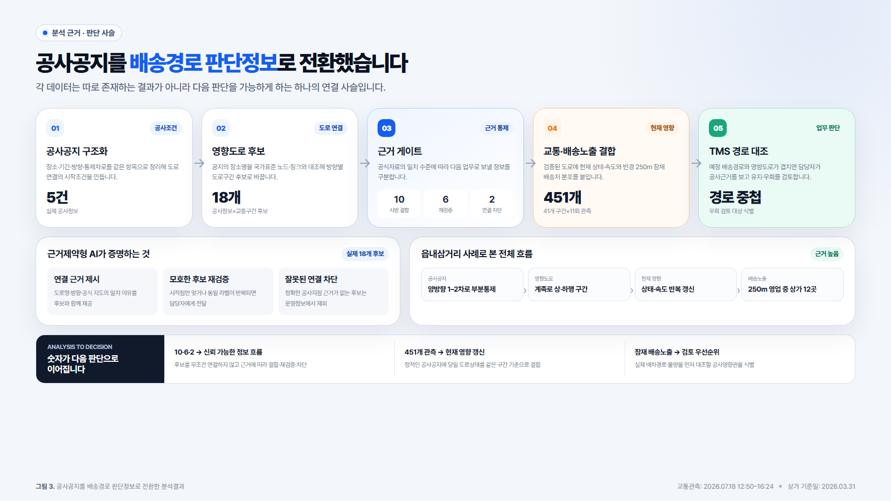
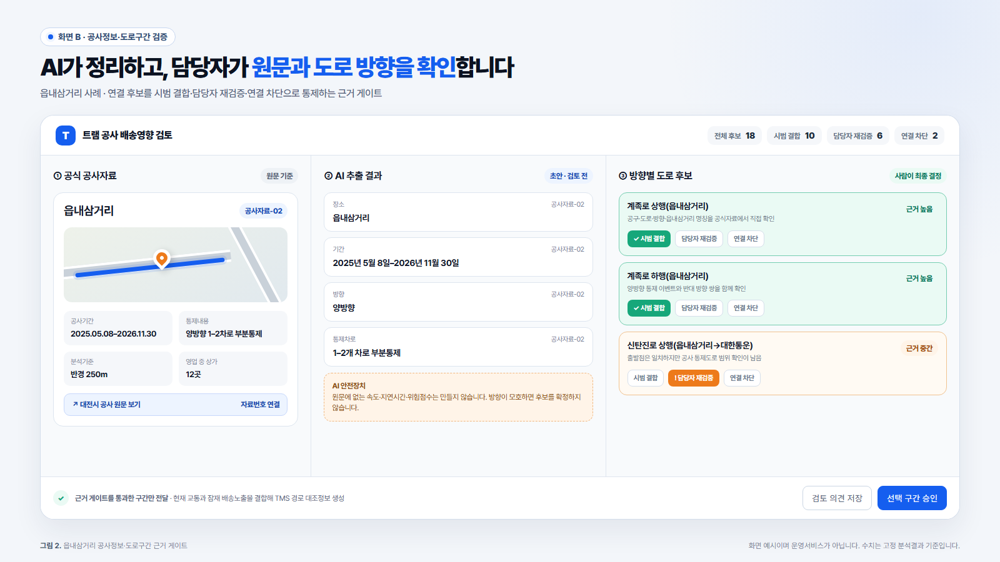

# [서식3] 분석 과정 보고서 원고

> 제출원고 v1.2, 2026-07-22. 공식 [서식3] 항목에 맞춰 데이터 선택·전처리·검토 과정과 AI 활용 기록을 시각자료와 함께 완성했다. 팀정보는 사실확인이 필요하므로 자리표시자로 남겼으며 제출 전 공식 HWP에 입력·확인한다.

## 기본정보

| 항목 | 입력내용 |
|---|---|
| 접수번호 | 접수처 기재 |
| 공모분야 | ☑ 지정3(도시 변화 대응) |
| 주제 | **대전 트램 공사공지를 배송경로 판단정보로 전환하는 근거제약형 AI 모듈** |
| 팀명 | [사용자 입력 필요] |

이 분석은 흩어진 세 자료를 하나의 배송판단 사슬로 연결할 수 있는지를 검증했다. 대전시 트램 공사·교통정보는 공사조건과 현재 도로흐름을, 국가표준 노드·링크는 방향별 영향도로를, 소상공인시장진흥공단 상가정보는 잠재 배송노출을 맡는다. 세 자료를 같은 도로구간에 결합해 기존 TMS의 경로판단으로 이어지는 구조를 확인했다.

## 1. 데이터 수집·전처리·분석

### 1.1 데이터 선택과 제외

대전 트램 공사·교통 페이지에서는 공사 위치·기간·차로통제와 1·12공구의 구간별 교통상태를 확인했다. 국가표준 노드·링크는 사람이 읽는 장소명을 배차시스템이 대조할 수 있는 방향별 도로구간으로 바꾸는 데 사용했다. 상가정보는 공사 영향권에 잠재 배송처가 얼마나 분포하는지 계산해 실제 배차경로와 물량을 먼저 확인할 지역을 정하는 데 사용했다.

대전교통정보 공개 API(프로그램이 데이터를 요청하는 통로)와 기상청 시간자료도 사용 가능성을 확인했지만 실제 요청이 서버에서 거부되어 데이터를 받지 못했다. 확보하지 못한 자료를 사용한 것처럼 쓰지 않고 분석에서 제외했다.

### 1.2 공사장소를 방향별 도로구간으로 연결

대전시 공사페이지에서 공사정보 5건의 장소·기간·통제내용·방향을 사람이 먼저 정리해 AI 추출 결과의 비교기준으로 만들었다. 공사 이미지 2건과 공지문 1건은 원문 주소와 파일의 디지털 지문을 함께 기록해 근거가 바뀌거나 다른 자료와 섞이지 않도록 관리했다.

공사장소와 교통화면의 도로구간을 비교해 18개의 연결 후보를 만들었다. 공사정보 5건이 도로 후보 18개로 늘어난 결과는 장소명과 방향별 도로구간이 일대일로 맞지 않음을 확인한다. 공식 이미지·공지문·도로명·진행방향을 차례로 대조해 10개는 **시범 데이터 결합**, 6개는 **담당자 재검증**, 2개는 **연결 차단**으로 분류했다. 근거 게이트는 후보를 모두 정답으로 처리하지 않고 다음 분석 단계로 보낼 정보를 근거 수준에 따라 통제한다.

읍내삼거리 공사는 공구·도로·방향·장소명이 직접 일치한 계족로 상·하행 구간을 시범 결합했다. 신탄진로 후보는 출발점만 일치해 담당자 재검증 대상으로 두고 테미고개와 정확히 일치하지 않은 충무로 후보는 연결을 차단했다. 서대전역네거리~서대전네거리는 국가표준 도로자료에서 계백로 양방향으로 확인했다. 서대전네거리 방향 4개 구간 654.016m와 반대 방향 4개 구간 650.315m를 재현했다.

### 1.3 현재 교통상태를 반복 결합

도로구간이 확정되면 정적인 공사공지를 현재의 배송판단 정보로 갱신한다. 대전 트램 1·12공구 교통화면을 2026년 7월 18일 12시 50분부터 16시 24분까지 11차례 확인했다. 매 확인 때마다 41개 구간의 상태와 속도가 제공돼 총 451개 기록을 확보했다. 원문 화면은 확인시각과 출처를 함께 보존하고 구간명·상태·속도·확인시각을 표 형식으로 정리했다.

같은 이름의 구간이 화면에 여러 번 나타난 경우에는 공구번호와 화면 순서를 함께 기록해 임의로 합치지 않았다. 공사정보와 상태·속도·갱신시각을 같은 도로구간에 반복해서 붙이는 구조도 확인했다. 초기 보안인증서 문제로 실패한 기록은 성공자료와 분리했다. 통신 설정을 수정한 뒤 11차례 수집을 완료했다.

451개 관측기록은 계획공사와 당일 도로흐름을 하나의 정보사슬에서 반복 갱신했음을 확인한다. 이 결합은 한 번 읽고 끝나는 공사공지를 배차 전에 다시 확인하는 공사영향 정보로 바꾼다.

### 1.4 잠재 배송노출 분석

같은 차로통제라도 주변에 배송차량이 방문할 영업지점이 많이 분포하면 더 많은 배송업무가 공사영향권에 닿는다. 이 노출을 확인하려고 2026년 3월 31일 기준 대전 상가정보 78,607건에서 영업 중인 점포의 위치를 사용했다. 위도와 경도를 미터 단위 좌표로 바꾼 뒤 공사 지점이나 도로에서 250m 안에 있는 상가 수를 계산했다.

세 시범 공사 영향권에서 각각 69곳·12곳·994곳의 영업 중 상가 분포를 확인했다. 이 잠재 배송노출은 공사구간별로 실제 배차경로와 물량을 먼저 대조할 대상을 정하는 정보다. 도입 단계에서는 영향도로·현재 교통·잠재 배송노출을 기존 TMS의 예정 경로와 연결해 유지·우회 검토가 필요한 배송경로를 표시한다.

분석에 사용한 출처, 기준일, 파일 확인기록은 03_analysis/references/sources.md에서 관리한다.

<figure>
  
  <figcaption><strong>그림 1. 공사공지를 배송경로 판단정보로 전환한 분석결과.</strong> 교통관측 2026.07.18 12:50–16:24, 상가 기준일 2026.03.31.</figcaption>
</figure>

## 2. 활용 AI 도구

### 2.1 공모전 준비과정에서 실제 사용한 AI

OpenAI Codex는 아이디어 비교, 공식자료 조사 보조, 데이터 처리절차 설계, 반론 점검, 결과 해석과 문서 초안 작성에 활용했다. AI가 제시한 답을 출처로 인용하지 않았다. 공식문서, 실제 웹 응답, 파일 확인값과 고정 분석결과를 참가자가 다시 대조한 뒤 채택 여부를 결정했다.

### 2.2 제안 서비스에 적용할 AI

제안 서비스에는 **근거제약형 생성 AI**를 적용한다. AI는 공지문과 공사이미지에서 장소·기간·방향·통제차로를 뽑고 방향별 도로 후보와 연결 근거를 설명한다. 담당자는 근거에 따라 시범 데이터 결합·재검증·연결 차단을 결정한다. 시스템은 검증된 구간의 현재 교통과 잠재 배송노출을 배송위험 요약으로 만든다.

위험요약의 주요 문장에는 원래 공지나 이미지로 돌아가는 ‘근거 보기’ 링크와 짧은 자료번호를 붙인다. 담당자는 통제내용과 도로 연결이 실제 공지에 근거하는지 바로 확인하고 근거가 부족한 후보를 다음 업무단계로 보내지 않는다. 근거 게이트는 AI의 빠른 정리를 책임 있는 배송정보로 바꾸는 핵심 장치다.

거리계산, 좌표변환과 상가 수 집계에는 AI 대신 미리 정한 계산절차를 적용한다. 공사구간의 최종 선택도 담당자가 공식자료를 확인한 뒤 결정한다. 제안 서비스의 AI 기능은 앞으로 평가할 설계다. 이미 성능검증을 마친 기능으로 제시하지 않는다.

<figure>
  
  <figcaption><strong>그림 2. AI 결과물의 근거 게이트.</strong> 읍내삼거리 공사자료 1건과 연결 후보 3개를 적용해 시범 결합·담당자 재검증을 구분한 개념 시안이다.</figcaption>
</figure>

## 3. 주요 프롬프트

### 프롬프트 1 — 주제와 차별성 검토

- 활용단계: 공모주제 선정
- 입력: “지정공모 5개와 자유공모를 적합성·데이터 접근성·차별성으로 비교하고, 공식 붙임과 선행수상작을 근거로 아이디어를 제안하라.”
- 결과·검토: 트램 공사로 인한 도심배송 위험을 선택했다. 트램 차량을 물류수단으로 쓰는 안과 자체 경로최적화는 기존 수상작·상용서비스와 역할이 겹쳐 제외했다.

### 프롬프트 2 — 데이터의 실제 사용 가능성 확인

- 활용단계: 데이터 검증
- 입력: “API의 실제 호출·필드·한도·갱신주기와 대체경로를 검증하라. 실패한 자료를 사용 가능으로 쓰지 말라.”
- 결과·검토: 대전교통정보와 기상청 자료는 실제 요청이 거부돼 제외했다. 실제로 확보한 트램 페이지, 국가표준 도로자료와 상가정보만 분석에 사용했다.

### 프롬프트 3 — 공사장소와 도로 연결 검토

- 활용단계: 공사장소와 도로구간 연결
- 입력: “이름이 비슷하다는 이유만으로 연결하지 말고 공식 이미지·공지·표준 도로자료로 방향과 범위를 검증하라. 모호하면 제외하라.”
- 결과·검토: 테미고개에 대한 초기 추정을 폐기했다. 같은 이름의 구간이 반복된 경우에는 확실한 하나를 임의로 고르지 않고 추가 확인 대상으로 분류했다.

### 프롬프트 4 — 미래 교통예측 평가설계

- 활용단계: 향후 확장기능 검토
- 입력: “현재 시점까지 알 수 있는 값만 사용해 30분 뒤를 예측하라. 시간순으로 학습자료와 시험자료를 나누고 단순한 기준방법과 비교하라. 최소자료가 부족하면 중단하라.”
- 결과·검토: 최소 288회·48시간·3개 날짜·5,000개 학습사례라는 시작조건을 세웠다. 현재 자료는 조건에 미달하므로 예측 성능을 결과에서 제외했다.

### 프롬프트 5 — 서비스 안의 AI 역할 재설계

- 활용단계: 핵심 기능 확정
- 입력: “AI·데이터 활용 공모전에서 서비스 안의 AI 역할이 분명해야 한다. 현재 데이터로 설명하고 평가할 수 있는 AI 기능을 제안하라.”
- 결과·검토: 자료가 부족한 30분 예측 대신 공사정보 정리, 도로 후보의 근거 설명, 출처가 연결된 배송위험 요약을 핵심 AI 기능으로 선택했다.

## 4. AI 결과물 검토·수정 과정

### 사례 1 — 권장 출차시간 삭제

AI는 교통위험이 낮은 시간대를 출차시간으로 추천하는 안을 제시했다. 그러나 영업소의 분류완료, 상차, 기사·차량, 배송마감 조건이 없으면 책임 있는 출차추천을 만들 수 없다. 참가자는 출차시간 추천을 삭제했다. 공사와 교통위험 정보만 기존 배차시스템과 담당자에게 전달하도록 범위를 바꿨다.

### 사례 2 — 30분 예측을 장기기능으로 이동

초안은 30분 교통예측을 핵심 기능으로 두었다. 실제 자료는 11차례, 약 3시간 35분, 하루치에 불과해 예측모델을 평가할 수 있는 최소조건에 미달했다. 참가자는 예측값과 성능 주장을 삭제했다. 관측자료는 공사·교통·상가 데이터를 연결하는 구조를 확인하는 데만 사용했다.

### 사례 3 — AI가 답의 근거를 보여주도록 변경

초기 서비스 설명은 AI가 위험요약을 만든다고만 적어 담당자가 그 내용을 왜 믿어야 하는지 설명하지 못했다. 참가자는 AI가 주요 문장마다 원래 공지나 이미지로 돌아가는 링크를 제시하고 모호한 구간은 추가 확인을 요청하도록 기능을 바꿨다. 숫자 계산은 정해진 절차가 맡는다. 실제 도로구간은 담당자가 공식자료를 보고 선택하도록 책임도 분리했다.

### 사례 4 — 분석 결과를 배송판단 사슬로 재구성

AI 초안은 18개 도로 후보, 451개 교통기록과 주변 상가 수를 서로 떨어진 분석결과로 제시했다. 참가자는 각 결과가 배송경로 판단에 어떻게 이어지는지 한 번에 이해하기 어렵다고 지적했다. 18개 후보의 분류는 근거 게이트, 451개 기록은 현재 교통의 반복 갱신, 상가 수는 잠재 배송노출의 근거로 역할을 다시 정했다. 원고와 시각자료도 ‘공지 구조화→영향도로→근거 검증→현재 영향→배송노출→TMS 경로 대조’의 순서로 재구성했다.

## 5. 팀 기여 내용

- 참가자: 공모방향과 주제 선택, 출차시간 추천·독립 배차도구·예측 중심안에 대한 문제 제기, 핵심 AI 기능 확정, 결과 해석과 최종 제출 판단
- AI 도구: 공식자료 탐색 보조, 데이터 검증절차, 예측평가 기준, 근거를 보여주는 AI 구조와 문서 초안 제안
- 참가자와 AI의 공동 검증: 웹 응답상태, 공식 이미지와 파일 동일성, 표준 도로구간과 거리, 제안서 수치·출처 일치 여부 확인
- 최종 원고·개인정보·동의·서명: [대표자 및 팀원 입력·확인 필요]

현재 분석은 공사정보 5건과 도로 연결 후보 18개, 시범 데이터 결합 구간 10개를 AI 평가기준으로 준비했다. 1단계 시험에서는 이 기준표와 AI 결과를 같은 조건에서 대조해 항목 정확도, 근거 연결률, 근거 없는 내용의 비율, 재검증·차단 적절성과 사람의 수정량을 측정한다. 이어 개인정보가 없는 실제 경로와 영향도로의 일치율을 확인해 공사영향 정보가 기존 TMS의 유지·우회 결정으로 연결되는지를 평가한다.

제안 화면은 공사정보 검토 대기목록, 공사정보·도로구간 근거 게이트, 배송위험 요약의 세 부분으로 구성했다. 화면에는 공사기간·방향·통제차로, 사람이 승인한 방향별 도로구간, 현재 교통상태·속도·갱신시각, 주변 250m 잠재 배송노출과 출처를 표시한다. 기존 TMS가 이 정보를 예정 경로와 대조하면 담당자는 유지·우회 결정을 내려야 할 경로를 바로 확인한다.
