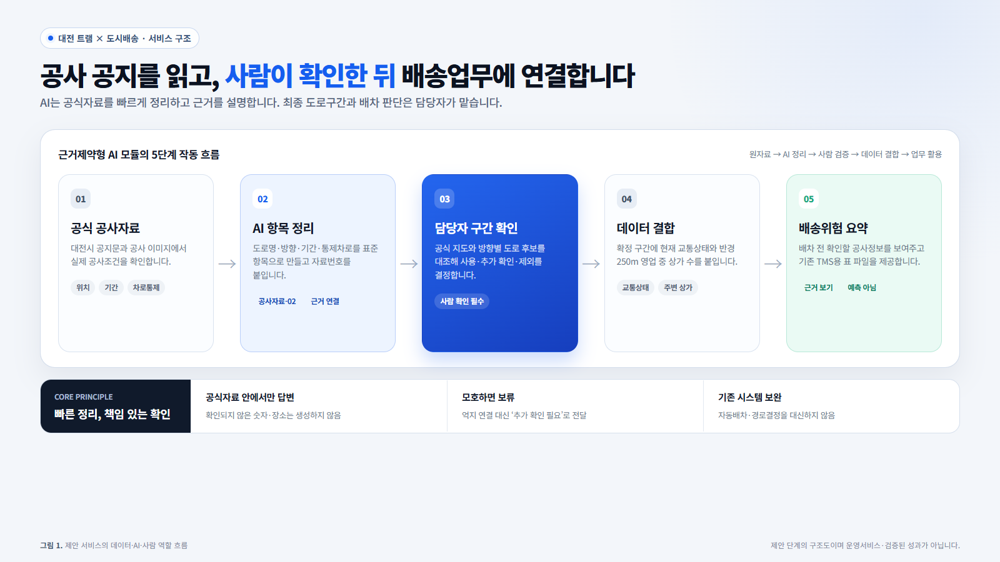

# [서식2] 제안서 원고

> 제출원고 v1.0, 2026-07-20. 공식 [서식2]의 6개 평가항목에 맞춰 본문과 시각자료를 완성했다. 팀명·대표자 정보는 사실확인이 필요하므로 자리표시자로 남겼으며, 제출 전 공식 HWP에 입력·확인한다.

## 표지·기본정보 [1쪽]

| 항목 | 입력내용 |
|---|---|
| 접수번호 | 접수처 기재 |
| 공모분야 | ☑ 지정3(도시 변화 대응) |
| 주제 | **대전 트램 공사정보를 배송위험으로 전환하는 근거제약형 AI 모듈** |
| 팀명 | [사용자 입력 필요] |

### 활용 데이터

| 데이터명 | 이 제안에서 하는 역할 | 선정 이유 | 출처 |
|---|---|---|---|
| 대전 트램 공사·교통정보 | 공사 위치·기간·차로통제와 공사구간 주변의 교통상태 확인 | 실제 트램 공사내용과 도로상황을 함께 제공하는 대전시 공식자료 | 대전광역시 트램 공사·교통상황 페이지 |
| 국가표준 노드·링크 | 공사 지점을 실제 도로구간과 진행방향에 연결 | 도로를 일정한 구간과 방향으로 나눈 국가 표준자료 | ITS 국가교통정보센터 |
| 상가(상권)정보 | 공사구간 주변에서 배송이 발생할 가능성이 있는 영업 중 상가 수 계산 | 실제 주문정보 없이도 배송활동이 집중될 가능성이 있는 지역을 비교할 수 있는 공공데이터 | 공공데이터포털, 소상공인시장진흥공단 |

## 1. 주제선정 [2쪽]

### 1.1 한눈에 보는 제안

대전 트램 공사가 시작되면 도로 일부가 통제되고 교통흐름이 달라질 수 있지만, 공사 공지와 교통정보는 서로 다른 화면에 흩어져 있다. 택배 영업소나 도시배송 배차담당자가 이를 업무에 활용하려면 공사 위치가 어느 도로구간에 해당하는지 직접 찾고, 그 구간의 교통상태와 주변 배송수요를 다시 확인해야 한다.

이 제안은 대전시의 공사 공지와 이미지를 인공지능이 읽어 배송담당자가 바로 확인할 수 있는 ‘배송위험 요약’으로 바꾼다. 여기서 배송위험은 사고확률이나 지연시간을 자동 예측한 숫자가 아니다. 공사 위치·기간·방향·통제차로, 현재 교통상태, 주변 영업 중 상가 수처럼 배차 전에 함께 살펴봐야 할 정보를 뜻한다.

핵심은 **근거제약형 AI**다. 이는 공식자료에 적힌 내용만 정리하고, 확인할 수 없는 값은 그럴듯하게 채우지 않는 AI를 말한다. AI가 작성한 요약에는 어떤 공지와 지도를 참고했는지도 함께 보여준다. 담당자는 짧은 요약을 읽은 뒤 필요하면 원자료를 바로 확인하고, 기존 배차시스템에서 경로와 차량운영을 결정한다.

### 1.2 왜 지금 필요한가

현재 공사정보만 보고는 물류영향을 바로 판단하기 어렵다. 공지문에는 “서대전역네거리~서대전네거리”처럼 장소명이 적혀 있지만, 디지털 지도와 경로시스템은 도로를 방향별 구간으로 나눠 다룬다. 같은 도로라도 상행과 하행의 통제영향이 다를 수 있고, 같은 이름의 교통구간이 화면에 여러 번 나타나기도 한다. 결국 담당자가 공지문·지도·교통화면을 번갈아 보며 어느 구간을 주의해야 하는지 다시 해석해야 한다.

이 제안은 그 반복작업을 ‘AI의 자료 정리 → 사람의 확인 → 배송정보 제공’이라는 한 흐름으로 바꾼다. AI는 긴 공지와 이미지에서 필요한 항목을 먼저 뽑고, 담당자는 AI가 제시한 도로 후보가 실제 공사 위치와 맞는지만 확인한다. 이렇게 확정한 정보만 배송담당자에게 전달하므로, 빠른 요약과 책임 있는 확인을 함께 확보할 수 있다.

### 1.3 실제 사용 흐름

1. **공사정보가 게시된다.** 대전시가 공사 위치, 기간, 통제내용을 공지문이나 이미지로 공개한다.
2. **AI가 필요한 내용을 정리한다.** AI는 도로명, 시작·종료 지점, 공사기간, 진행방향, 통제차로를 항목별로 정리한다.
3. **교통·공사 담당자가 도로구간을 확인한다.** AI가 제시한 후보를 공식 공지와 지도에서 대조한 뒤, 실제로 사용할 방향별 도로구간을 선택한다. 근거가 부족하면 억지로 선택하지 않고 ‘추가 확인 필요’로 남긴다.
4. **시스템이 관련 데이터를 결합한다.** 확정된 도로구간에 현재 교통상태와 반경 250m 안의 영업 중 상가 수를 붙인다.
5. **배송담당자가 위험요약을 확인한다.** 택배 영업소나 배차담당자는 공사구간과 주의사항을 먼저 확인하고, 기존 배차시스템에서 최종 경로와 출차계획을 결정한다.

<figure>
  
  <figcaption><strong>그림 1. 제안 서비스의 데이터·AI·사람 역할 흐름.</strong> 출처: 참가자 설계. 제안 단계의 구조도이며 운영서비스나 검증된 성과를 의미하지 않는다.</figcaption>
</figure>

### 1.4 제공하는 정보

- 공사가 진행되는 도로와 방향, 공사기간, 통제되는 차로
- 해당 구간의 현재 교통상태와 정보가 갱신된 시각
- 공사구간 주변 250m 안의 영업 중 상가 수
- AI가 왜 이 도로구간과 관련 있다고 판단했는지 보여주는 설명
- 공사 공지나 이미지로 바로 돌아가 확인할 수 있는 ‘근거 보기’ 링크
- 기존 배차시스템에서 읽을 수 있는 표 형식의 파일

**확보한 자료를 적용한 예시:** 읍내삼거리 공사정보는 ‘2025년 5월 8일~2026년 11월 30일 공사계획, 양방향 1~2개 차로 부분통제, 주변 250m 안의 영업 중 상가 12곳’으로 정리된다. 담당자는 공식 공사이미지와 교통화면의 구간명이 일치하는지 확인하고, ‘근거 보기’에서 대전시 원문을 다시 볼 수 있다. 이처럼 긴 공지와 여러 화면을 한 번에 검토할 수 있는 정보로 바꾸는 것이 위험요약의 실제 모습이다.

‘근거 보기’ 링크는 단순한 출처 장식이 아니다. 예를 들어 AI가 “양방향 1~2개 차로가 통제된다”고 요약했다면, 담당자는 링크를 눌러 실제 공지문이나 이미지를 즉시 확인할 수 있다. 각 자료에는 ‘공사자료-01’처럼 짧은 자료번호도 붙여 어떤 문장이 어느 자료에서 나왔는지 구분한다. 이는 AI의 설명을 그대로 믿게 하는 기능이 아니라, 사람이 더 빨리 검증하도록 돕는 장치다.

운송관리시스템(TMS)은 주문, 차량, 기사, 배차와 경로를 관리하는 기존 업무시스템이다. 본 제안은 TMS를 새로 만들거나 대신하지 않는다. 공사 때문에 어느 도로를 주의해야 하는지를 정리해 기존 TMS와 배차담당자에게 제공한다.

## 2. 데이터 활용 [3~4쪽]

### 2.1 세 데이터가 각각 답하는 질문

| 확인할 질문 | 사용하는 데이터 | 분석내용 | 배송업무에 주는 의미 |
|---|---|---|---|
| 어디에서 언제 어떤 공사가 진행되는가? | 대전 트램 공사정보 | 장소, 기간, 방향, 차로통제 추출 | 배송 전 확인해야 할 공사조건을 알 수 있음 |
| 공사장소는 실제 어느 방향의 도로구간인가? | 국가표준 노드·링크 | 장소명과 방향별 도로구간 연결 | 배차시스템의 경로정보와 연결할 수 있음 |
| 공사 주변에 배송처가 얼마나 분포하는가? | 상가(상권)정보 | 공사구간 250m 안의 영업 중 상가 수 계산 | 상세 검토가 필요한 지역의 규모를 비교할 수 있음 |
| 현재 해당 구간의 흐름은 어떤가? | 대전 트램 교통정보 | 구간별 상태·속도와 갱신시각 확인 | 계획된 공사정보와 당일 도로상황을 함께 볼 수 있음 |

세 데이터는 서로 대체하는 관계가 아니다. 공사정보는 ‘무슨 일이 생기는지’, 표준 도로자료는 ‘어느 길에 해당하는지’, 교통정보는 ‘지금 어떻게 움직이는지’, 상가정보는 ‘주변에 배송처가 얼마나 분포하는지’를 설명한다. 이 네 질문을 한 화면에서 이어 보는 것이 본 분석의 핵심이다.

### 2.2 실제 확인한 교통자료

2026년 7월 18일 12시 50분부터 16시 24분까지 트램 1·12공구 교통화면을 11차례 확인했다. 그 결과 매번 41개 구간의 상태와 속도를 확인해 총 451개 기록을 확보했다. 이 자료로 트램 페이지의 교통정보가 같은 구간 단위로 반복 제공되고, 공사정보와 결합할 수 있는 형태인지 확인했다.

관측기간은 약 3시간 35분으로 짧기 때문에 이 자료로 미래 교통을 예측하지는 않는다. 현재 단계에서는 공사정보와 교통상태를 같은 도로구간에 붙이는 구조를 검증하는 데 사용한다. 즉, 451개 기록의 의미는 높은 AI 성능을 입증했다는 것이 아니라 실제 대전시 자료로 서비스의 데이터 흐름을 확인했다는 데 있다.

### 2.3 공사장소와 실제 도로를 연결한 결과

공사정보 5건을 대상으로 공지에 적힌 장소와 교통화면의 도로구간을 비교해 18개의 연결 후보를 만들었다. 공식 이미지, 공지문, 도로명과 진행방향을 차례로 대조한 결과 10개 구간은 시범분석에 사용했고, 6개는 추가 확인 대상으로 남겼으며, 2개는 근거가 부족해 제외했다.

예를 들어 서대전역네거리~서대전네거리는 국가표준 도로자료에서 계백로 양방향 구간으로 확인됐다. 서대전네거리 방향은 4개 구간, 약 654m이고 반대 방향은 4개 구간, 약 650m다. 반면 테미고개는 공사장소와 정확히 일치하는 교통화면 구간을 확인하지 못해 시범분석에서 제외했다. 이처럼 비슷한 이름만으로 연결하지 않고, 확인 가능한 구간만 사용한다.

### 2.4 주변 상가 수가 필요한 이유

공사구간 주변의 상가 수는 ‘이 지역에 택배가 몇 건 배달된다’는 뜻이 아니다. 실제 주문·송장 자료를 확보하지 않은 상태에서, 배송차량이 들를 가능성이 있는 영업지점이 어느 정도 모여 있는지를 같은 기준으로 비교하기 위한 간접지표다.

2026년 3월 31일 기준 대전 상가정보 78,607건에서 영업 중인 점포의 위치를 사용했다. 공사와 직접 인접한 주변을 모든 지역에서 같은 폭으로 비교하기 위해 시범분석 거리를 250m로 고정했다. 공사 지점이나 도로에서 250m 안에 있는 상가를 계산한 결과 계족로 공사구간 69곳, 읍내삼거리 12곳, 계백로 공사구간 994곳으로 나타났다. 이 결과만으로 배송지연을 단정하지는 않는다. 대신 공사정보를 검토할 때 주변 배송처가 많이 분포한 구간을 먼저 살펴볼 수 있다. 예를 들어 계백로는 다른 두 분석대상보다 주변 상가가 많이 잡혀, 실제 배차경로와 배송물량을 추가로 확인할 우선대상임을 보여준다.

## 3. AI 활용 [5쪽]

### 3.1 왜 AI를 사용하는가

트램 공사정보는 표의 정해진 칸에만 들어오지 않는다. 위치와 통제내용이 공지문 문장에 적히기도 하고, 지도 이미지 안에 표시되기도 한다. 표현 방식도 공사마다 달라 단순한 검색어나 고정 규칙만으로 필요한 내용을 빠짐없이 정리하기 어렵다.

생성형 AI는 문장과 이미지에서 의미를 읽어 같은 항목으로 정리하는 데 적합하다. 그러나 생성형 AI는 입력에 없는 내용을 자연스럽게 만들어낼 수 있다. 그래서 본 제안은 AI에 모든 판단을 맡기지 않고, ‘자료에 적힌 내용만 추출하고 출처를 보여주는 역할’에 집중시킨다.

### 3.2 핵심 AI 기능

1. **공사내용 정리:** 공지문과 이미지에서 장소, 도로명, 기간, 방향, 통제차로를 뽑아 같은 양식으로 정리한다.
2. **도로 후보 설명:** 장소명과 가까운 도로구간 후보를 비교하고, 어떤 도로명·방향·공식 지도 때문에 관련 있다고 본 것인지 설명한다.
3. **모호한 사례 보류:** 같은 이름의 구간이 여러 개이거나 방향이 적혀 있지 않으면 임의로 하나를 고르지 않고 추가 확인 대상으로 돌린다.
4. **배송위험 요약 작성:** 공사내용, 현재 교통상태, 주변 상가 수를 담당자가 빠르게 읽을 수 있는 순서로 정리한다.
5. **확인 근거 연결:** 요약의 주요 문장마다 원래 공지나 이미지로 돌아갈 수 있는 출처 링크와 자료번호를 붙인다.

### 3.3 AI·계산절차·사람의 역할 구분

| 구분 | 맡는 일 | 맡기지 않는 일 |
|---|---|---|
| AI | 공지문·이미지 읽기, 항목 정리, 후보 비교이유 설명, 요약문 작성 | 거리와 상가 수를 임의로 계산하거나 최종 도로구간을 확정하지 않음 |
| 미리 정한 계산절차 | 좌표변환, 거리계산, 250m 안의 상가 수 집계, 파일형식 검사 | 공지문의 의미나 모호한 장소명을 해석하지 않음 |
| 담당자 | 공식자료 확인, 실제 공사구간 선택, 최종 사용 승인 | 모든 자료를 처음부터 수작업으로 다시 정리하지 않음 |

이 역할분담은 AI의 장점과 위험을 동시에 고려한 설계다. AI는 사람이 오래 걸리는 읽기와 정리를 맡고, 숫자는 같은 입력이면 같은 결과가 나오는 계산절차로 처리한다. 실제 공사구간의 최종 선택은 업무 책임이 있는 담당자가 맡는다.

<figure>
  
  <figcaption><strong>그림 2. 읍내삼거리 공사정보·도로구간 검증 화면.</strong> 출처: 대전시 공사자료와 고정 분석결과를 바탕으로 참가자 구성. 화면 예시이며 운영서비스가 아니다.</figcaption>
</figure>

### 3.4 공모전 준비과정에서 실제 사용한 AI

OpenAI Codex는 아이디어 비교, 공식자료 조사 보조, 데이터 처리절차 설계, 반론 점검과 초안 작성에 활용했다. AI 답변을 사실 근거로 사용하지 않고 공식문서, 실제 웹 응답, 파일 확인값과 고정 분석결과를 다시 대조했다.

AI가 처음 제안한 ‘권장 출차시간’과 독립 배차도구는 삭제했다. 출차시간은 분류완료, 상차, 기사·차량, 배송마감처럼 현재 확보하지 않은 운영조건에 따라 달라지기 때문이다. 또한 자료가 부족한 30분 교통예측은 핵심 기능에서 제외하고, 현재 데이터로 설명하고 평가할 수 있는 공사정보 정리 AI를 중심 기능으로 확정했다.

## 4. 분석방법 [6~7쪽]

### 4.1 전체 처리순서

1. 대전시 공사 공지문과 이미지를 수집한다.
2. AI가 장소·기간·방향·통제차로를 정해진 항목으로 정리한다.
3. 국가표준 도로자료에서 장소명과 방향이 맞는 후보구간을 찾는다.
4. AI가 후보별 일치 근거와 충돌내용을 설명한다.
5. 담당자가 공식 공지와 지도를 확인해 사용할 도로구간을 선택한다.
6. 선택된 구간에 현재 교통상태와 주변 250m 상가 수를 결합한다.
7. 시스템이 배송위험 요약과 기존 시스템용 표 형식 파일을 만든다.

이 순서는 ‘AI가 빠르게 정리하되 사람이 근거를 보고 확정한다’는 원칙을 따른다. 따라서 AI가 잘못된 도로를 자신 있게 선택하거나, 존재하지 않는 숫자를 만들어 운영정보로 전달하는 위험을 줄인다.

### 4.2 현재까지 확인한 결과

| 확인 항목 | 실제 결과 | 이 결과가 보여주는 것 |
|---|---:|---|
| 공사정보 | 5건 | 위치·기간·차로통제를 같은 형식으로 정리할 수 있음 |
| 공사정보와 도로구간의 연결 후보 | 18개 | 포함·추가 확인·제외를 근거에 따라 구분할 수 있음 |
| 시범분석에 사용한 도로구간 | 10개 | 교통상태와 주변 상가 수를 실제 구간에 결합할 수 있음 |
| 교통관측 | 11회, 451개 기록, 41개 구간 | 공사구간별 현재 교통정보를 반복해서 받을 수 있음 |
| 상가 분포 분석 | 공사정보 3건 | 같은 250m 기준으로 주변 영업지점 규모를 비교할 수 있음 |

<figure>
  
  <figcaption><strong>그림 3. 서비스 설계에 사용한 고정 데이터와 분석결과.</strong> 교통관측 2026.07.18 12:50–16:24, 상가 기준일 2026.03.31. 451개 기록은 예측 성능이 아니라 데이터 결합 가능성 확인용이다.</figcaption>
</figure>

### 4.3 AI 기능을 어떻게 평가할 것인가

사람이 공식 공지와 지도를 보고 미리 정리한 공사정보 5건과 도로 연결 후보 18개를 평가기준으로 사용한다. AI의 문장이 자연스러운지만 보는 것이 아니라, 실제 업무에 필요한 항목을 정확히 뽑고 근거를 보여주는지를 측정한다.

- **항목 정확도:** 도로명, 공사기간, 방향, 통제내용이 사람이 확인한 내용과 일치하는 비율
- **근거 연결률:** 주요 문장에 확인 가능한 출처 링크와 자료번호가 붙은 비율
- **근거 없는 내용의 비율:** 입력자료에 없는 장소·숫자·통제내용을 AI가 새로 만든 비율
- **보류 적절성:** 방향이 없거나 같은 이름이 반복되는 사례에서 AI가 추가 확인을 요청한 비율
- **사람의 검토부담:** 담당자가 고친 항목 수와 공사정보 1건을 확인하는 데 걸린 시간

이 지표는 AI가 얼마나 화려한 문장을 만드는지가 아니라, 담당자가 더 빠르고 안전하게 공사정보를 확인하도록 돕는지를 평가한다.

### 4.4 30분 교통예측의 위치

30분 뒤 교통상태 예측은 핵심 기능이 아니라 충분한 장기자료가 쌓인 뒤 검토할 확장기능이다. 최소 288회, 48시간, 3개 날짜와 5,000개 학습사례가 모였을 때만 평가를 시작한다. 시간순으로 과거와 시험기간을 나누고, ‘마지막 관측값이 그대로 이어진다’는 단순한 방법보다 예측오차가 실제로 줄어드는지 비교한다. 단순한 방법보다 낫지 않으면 예측기능을 사용하지 않는다.

현재 자료는 이 조건을 충족하지 않으므로 예측 성능을 제안의 성과로 사용하지 않는다. 본 제안의 현재 가치는 이미 확보한 공사·도로·교통·상가 데이터를 연결하고, AI가 그 근거를 이해하기 쉽게 정리하는 데 있다.

## 5. 타당성 및 차별성 [8~9쪽]

### 5.1 물류 현장에 적합한 이유

배송담당자에게 필요한 것은 또 하나의 경로추천 앱이 아니다. 기존 배차시스템이 놓치기 쉬운 지역 공사정보를 실제 경로와 연결해 주는 보완정보다. 본 제안은 주문이나 기사정보를 가져오지 않고도 공사구간과 교통상태를 먼저 정리한다. 실제 도입단계에서는 기존 시스템이 사용하는 도로번호와 연결하는 절차를 검증한다.

### 5.2 기존 서비스·선행 아이디어와의 차이

| 기존 서비스·선행 아이디어 | 주로 해결하는 문제 | 본 제안이 담당하는 부분 |
|---|---|---|
| 카카오 TMS | 여러 배송지의 자동배차, 경로최적화, 도착예정시간 계산 | 경로계산 전에 확인할 지역 계획공사 정보를 제공 |
| 카카오 미래 길찾기 | 미래 출발시각의 경로와 전체차선 통제 반영 | 부분차로 공사의 기간·방향·근거와 주변 배송처 분포를 관리 |
| CJ 로이스 파슬 | 택배 예약, 분류, 배차, 정산과 기사 업무 | 기존 택배시스템에 외부 공사위험 정보를 보완 |
| 2025년 트램 심야 공동물류 수상작 | 트램 차량과 거점을 새로운 물류수단으로 활용 | 트램 공사가 기존 도로배송에 주는 영향을 다룸 |
| 2025년 돌발상황 동적경로 수상작 | 재난·사고 등 돌발상황에서 경로를 최적화 | 사전에 예고된 계획공사를 읽고 확인 가능한 정보로 정리 |

차별점은 ‘AI가 공사 공지를 읽는다’는 기능 하나가 아니다. 공사 공지의 문장과 이미지를 방향별 도로구간으로 연결하고, 사람이 원자료를 확인한 뒤에만 배송정보로 사용하는 절차 전체가 차별점이다. 기존 시스템과 경쟁하지 않고, 기존 시스템이 경로를 계산하기 전에 필요한 지역 공사정보를 공급한다.

### 5.3 실행 가능성

첫째, 필요한 공공데이터를 실제로 확보해 공사정보 5건, 연결 후보 18개, 시범구간 10개와 주변 상가 분석 3건을 만들었다. 둘째, 초기에는 별도 대규모 시스템 연동 없이 표 형식 파일로 결과를 전달해 현장 검토를 시작할 수 있다. 셋째, 주문·주소·기사 개인정보를 수집하지 않고 도로구간 번호와 공개 공사정보만 사용한다.

따라서 첫 단계의 목표는 완성형 배차서비스 개발이 아니다. 현재 만든 기준표로 AI의 추출·근거제시 성능을 확인하고, 교통·공사 담당자와 배차담당자가 실제로 이해하고 수정할 수 있는 정보형식을 검증하는 것이다.

## 6. 발전가능성 [10쪽]

### 6.1 단계별 적용계획

| 단계 | 수행내용 | 통과 여부를 판단할 기준 |
|---|---|---|
| 1단계: AI 정확성 확인 | 공사정보 5건과 연결 후보 18개로 AI의 정보추출·근거제시 시험 | 항목 정확도, 근거 연결률, 근거 없는 내용의 비율, 보류 적절성 |
| 2단계: 담당자 사용성 확인 | 교통·공사 담당자와 배차담당자가 위험요약을 읽고 수정 | 확인시간, 수정 항목 수, 경고내용 이해도 |
| 3단계: 기존 시스템 연결 | 개인정보가 없는 도로구간 번호와 표 형식 파일을 실제 배차경로와 대조 | 도로구간 연결 성공률, 파일오류율, 오류 발생 시 기본처리 |
| 4단계: 지역·상황 확대 | 다른 도로공사, 행사, 도로개편으로 같은 절차 확대 | 새 지역의 연결 성공률, 공사정보 양식의 재사용률 |
| 5단계: 장기 예측 검토 | 충분한 장기 교통자료가 쌓이면 30분 예측을 별도 평가 | 단순 기준방법 대비 예측오차, 잘못 울린 경고와 놓친 경고 수 |

### 6.2 기대효과와 측정방법

| 기대하는 변화 | 확인할 지표 | 확인 방법 |
|---|---|---|
| 흩어진 공사자료를 찾고 다시 정리하는 부담 감소 | 공사정보 1건당 확인시간, 담당자가 수정한 항목 수 | 기존 수작업과 AI 보조방식 비교 |
| AI 결과를 믿을 수 있는지 빠르게 판단 | 근거가 연결된 문장 비율, 근거 없는 내용의 비율 | 원문과 AI 요약 대조 |
| 배차담당자가 공사영향을 놓치지 않고 확인 | 경고 이해도, 실제 경로와 공사구간의 일치율 | 담당자 검토와 개인정보를 포함하지 않은 실제 경로 대조 |
| 다른 도시변화 정보로 확장 | 새 공사·행사 자료의 재사용률 | 같은 정보항목과 처리절차 적용 여부 확인 |

대전 트램 공사는 장기간 여러 공구에서 진행되므로, 공사정보를 한 번 정리하고 끝내는 방식보다 같은 절차로 계속 갱신할 수 있는 정보구조가 필요하다. 향후 대전시 공사페이지가 도로구간 번호, 진행방향, 통제차로 수와 계획·실제 시각을 함께 제공하면 지도·교통시스템·배차시스템이 같은 공사정보를 더 쉽게 공유할 수 있다.

본 제안은 AI가 배차를 대신하는 서비스가 아니다. AI가 흩어진 공사자료를 먼저 읽고, 사람이 확인할 근거를 함께 제시하며, 확정된 정보만 기존 물류업무에 전달하는 서비스다. 이를 통해 대전의 도시변화 정보를 실제 배송 의사결정에 연결하는 작고 검증 가능한 출발점을 만든다.

## 출처

1. 대전 트램 공구별 공사·교통상황: https://www.daejeon.go.kr/djTram/getConstInfo.do?menuSeq=7699&zone=1 및 zone=12
2. 대전 트램 공사 알림: https://www.daejeon.go.kr/djTram/notify/normalBoardDetail.do?boardId=djTram_0001&menuSeq=6724&ntatcSeq=1495771010
3. 국가표준 노드·링크: https://www.its.go.kr/nodelink/nodelinkStatus?service=inquiryNodelink
4. 소상공인시장진흥공단 상가(상권)정보: https://www.data.go.kr/data/15083033/fileData.do
5. 카카오모빌리티 TMS: https://developers.kakaomobility.com/product/tms.html
6. 카카오 미래 운행정보 길찾기: https://developers.kakaomobility.com/guide/navi-api/future.html
7. CJ대한통운 로이스 파슬: https://www.cjlogistics.com/ko/newsroom/news/NR_00001138
8. 2026년 물류데이터·AI 활용 및 분석 아이디어 공모전 공고문의 2024·2025 수상작 목록

출처별 확인일과 자료 검증기록은 03_analysis/references/sources.md에서 관리한다.
